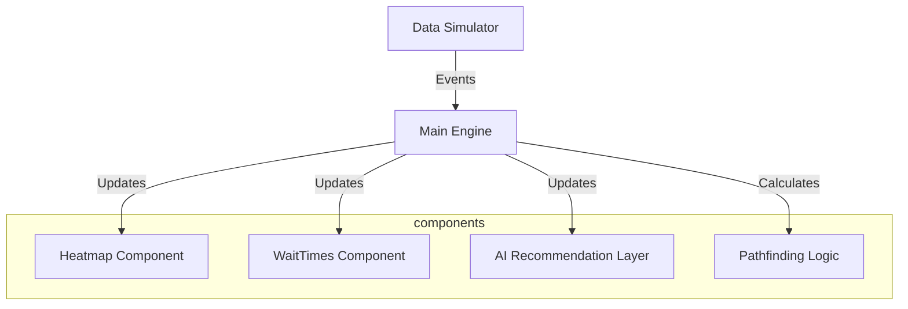

# 🏟️ CrowdSense AI
### Intelligent Stadium Management & Crowd Orchestration System

[](https://github.com/sirshivansh/crowdsense-ai)
[](https://vitejs.dev/)
[](https://crowdsense.ai)

**CrowdSense AI** is a high-fidelity, real-time stadium management platform that transforms raw attendee data into actionable intelligence. Designed for high-capacity venues, it leverages a sophisticated data-driven engine to optimize fan flow, minimize wait times, and maximize operational efficiency.

---

## 🚀 Vision
Large-scale venues often struggle with "opaque congestion"—data that exists but isn't actionable for the attendee or the operator. **CrowdSense AI** bridges this gap by providing a living, breathing digital twin of the stadium environment.

## ✨ Key Features

### 🏛️ Live Venue Mapping
- **Adaptive Heatmaps**: Real-time SVG visualization of crowd density across gates, sections, and food courts.
- **Living Zones**: Animated "flow particles" that reflect actual simulated movement patterns.
- **Interactive Tooltips**: Instant metrics on zone capacity and wait times.

### 🧠 AI Intelligence Layer
- **"Best Action" Engine**: A primary recommendation card that dynamically calculates the optimal path for attendees based on real-time data.
- **Smart Suggestions**: Context-aware insights (e.g., "Avoid Gate B — 85% capacity") updated in-place with zero UI flicker.
- **Predictive Analytics**: Admin-level charts forecasting congestion trends for the next 60 minutes.

### 🗺️ Smart Routing & Navigation
- **Congestion-Aware Pathfinding**: Plots routes that actively avoid high-density "danger zones."
- **Animated Draw-on Routes**: High-contrast, animated route lines with SVG markers (📍 Start, 🎯 Destination).
- **Time-to-Destination (ETA)**: Accurate estimates calculated by blending distance with real-time crowd penalties.

### 🛠️ Ops Dashboard (Admin View)
- **Live Observations**: A high-priority alert log for operational teams.
- **Interaction Highlights**: Use the "Alerts" navigation to instantly draw eyes to the most critical AI observations.
- **KPI Tracking**: Real-time attendance and average density monitoring at a glance.

---

## 🏗️ Architecture



### Technical Highlights
- **Vanilla Performance**: Built with pure JavaScript (ES Modules) for near-instant load times and zero framework overhead.
- **Flicker-Free Rendering**: Uses in-place DOM mutations rather than `innerHTML` rebuilds, ensuring a stable, "app-like" experience during high-frequency data updates.
- **Glassmorphism UI**: A premium dark-theme design system built with custom CSS variables and modern typography (Outfit/Inter).

---

## 🛠️ Local Development

### Installation
```bash
git clone https://github.com/sirshivansh/crowdsense-ai.git
cd crowdsense-ai
npm install
```

### Commands
- **Development**: `npm run dev` (Starts Vite dev server)
- **Build**: `npm run build` (Generates production-ready bundles in `/dist`)
- **Preview**: `npm run preview` (Local preview of production build)

---

## 📜 Deployment
The project is optimized for static hosting platforms like **Vercel**, **Netlify**, or **GitHub Pages**. 

1. Run `npm run build`.
2. Connect your repository to your host of choice.
3. Configure the build command as `npm run build` and the output directory as `dist`.

---

## 🛡️ License
Distributed under the MIT License. See `LICENSE` for more information.

---
*Created by the CrowdSense AI Team - Elevating the Stadium Experience.*